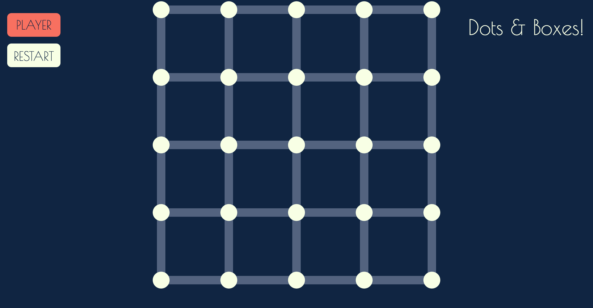

#Dots-&-Boxes!

####A game by Jacob Allen

[Play Dots & Boxes](https://yousaiditchewie.github.io/project_01)

___
###Rules of the game
___

1. Players alternate turns selecting lines to connect dots.
2. Once a box has been enclosed by lines, the player who completed the box gets a point. 
3. Completeing a box displays the player who completed the box, and that player gets another turn. 
4. When all of the boxes are completed, the player withe the most points (boxes) wins.  

___

###Technologies used
___
In Dots and Boxes, I used a combination of HTML, CSS, and JavaScript along with the jQuery API.  

___
###Design
___

My goal was to make an elegant-looking game with catchy colors that is very very to understand and operate.  

To achieve this, I chose the simple game that can be played on paper with two players.  It's logic is similar to Tic Tac Toe, but slightly more complex, which allows players to play for longer than a single game of Tic Tac Toe.      

Once the model was built and working properly, I spent time sampling color schemes and customizing them to be compelling and rich.  I wanted to compensate for the game's simplistic nature by drawing the user in with color.  The design of the buttons and interactions are are 2D with rounded corners which adds a playfulness to the look of the game. 

___
###Installation
___
No installation is required to play Dot's & Boxes, granted a web browser is already installed.  

Simply click the link to play.

[Play Dots & Boxes](https://yousaiditchewie.github.io/project_01)

___
###Unsolved Problems
___
There are a few additions I didn't have time to add to the game.

1. I'd like to ad a scoreboard so that the users don't have to count boxes on their own to see who's ahead.  
2. I'd like a feature that allows users to pick their own color scheme for the game.
3. I wanted the game board to be flexible for players to resize the game and to expand the grid for longer games. 
4. I also wanted a button that shows the rules of the game for people who may not know how to play. 

Here is a link to my [Trello](https://trello.com/b/cmXBxDmP/dots-and-boxes) page for the game.

